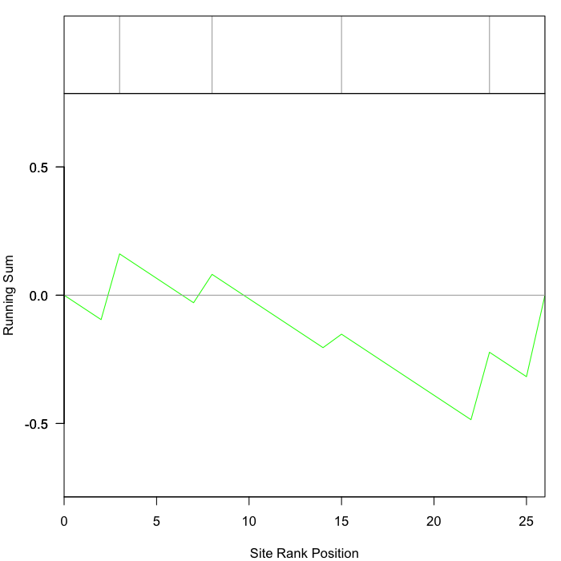

### Introduction

This package contains an implementation of the Kinase Set Enrichment Analysis (KSEA) used to predict kinase activities based on quantitative phosphoproteomic studies. Using a quantitative phosphoproteomic profile and a list of known targets, the algorithms predicts the activity of the based on the enrichment on top regulated sites within the known targets of the kinase.


###Installation

The `ksea` package can be installed directly from github (if public) or locally using the devtools package.


```r
install.packages('devtools')
```

#####Github installation


```r
require(devtools)
install_github("dogcaesar/ksea")
```

#####Local installation

You can clone this project and install it locally in your computer.


```r
require(devtools)
install("./ksea")
```

###Usage

First load the `ksea` package.


```r
library("ksea")
```

Next create some fake data. In one hand, we create a list named `regulons` containing a vector per kinase with the names of the known substrates. Secondly, we create a vector sites with quantifications for the sites going from A to Z. Finally, we sort the quantifications.


```r
regulons <- list(kinaseA=sample(LETTERS, 5))
regulons
```

```
## $kinaseA
## [1] "U" "R" "K" "W" "B"
```

```r
sites <- rnorm(length(LETTERS))
names(sites) <- LETTERS
sites <- sites[order(sites, decreasing=TRUE)]
sites
```

```
##           X           S           T           J           W           L 
##  2.03964660  1.13995026  0.98408247  0.96217826  0.94238455  0.75717575 
##           Y           F           B           C           M           D 
##  0.64501351  0.21789122  0.16696762  0.08473823  0.08440211  0.06538367 
##           H           R           A           V           U           O 
##  0.05037625 -0.07597367 -0.12130222 -0.14209150 -0.22397342 -0.22775377 
##           E           K           G           Q           I           P 
## -0.39107663 -0.41841140 -0.71550073 -0.78318404 -1.07056448 -1.25670785 
##           Z           N 
## -1.52230121 -1.83774065
```

The function `ksea` will run the enrichment analysis for the provided quantifications and known kinase targets.


```r
ksea_result <- ksea(names(sites), sites, regulons[["kinaseA"]], trial=1000, significance = TRUE)
```

 

```r
ksea_result
```

```
## $ES
##         W 
## 0.3251331 
## 
## $p.value
##     W 
## 0.464
```

The function `ksea_batchKinases` calculates the KSEA p-value for a list of kinases. To improve the performance of the function, it uses as many cores as possible using the `parallell` package.


```r
regulons[["kinaseB"]] <- sample(LETTERS, 3)
regulons[["kinaseC"]] <- sample(LETTERS, 7)
regulons
```

```
## $kinaseA
## [1] "U" "R" "K" "W" "B"
## 
## $kinaseB
## [1] "V" "P" "Z"
## 
## $kinaseC
## [1] "B" "I" "H" "M" "L" "P" "T"
```

```r
kinases_ksea <- ksea_batchKinases(names(sites), sites, regulons, trial=1000)
```

```
## Loading required package: parallel
```

```r
kinases_ksea
```

```
## kinaseA.W kinaseB.I kinaseC.Q 
##     0.456     0.017     0.338
```


### Developers

The package is documented using [roxygen2](http://cran.r-project.org/web/packages/roxygen2/index.html). After changing the code located in the `R/` folder remember to run 'make' on the main directory to create the documentation following the roxygen2 rules.

To work on the code you will need the `devtools` package installed (read above to installation guide).
